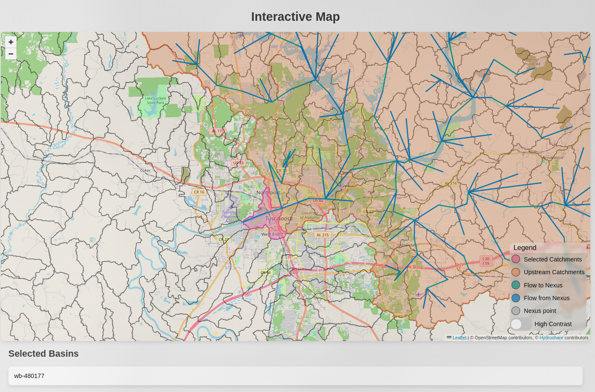

# Tools for NGIAB data preparation

### This is an early version, help us improve it.
This is still in development, your feedback and patience is appreciated.
If you have any suggestions to improve or find bugs that need fixing, submit an issue here on github.



## Aproximate workflow
1) Select the water basins you're interested in on the map
1) Click subset, this creates a geopackage with the waterbains you've selected + any basin upstream of it
1) Pick a date and time
1) Generate forcings for your water basins
1) Create a cfe realisation for your selected data

# Running with docker and devcontainers
The easiest way to get this all working is with [dev containers](https://code.visualstudio.com/docs/devcontainers/containers).     
It's a docker container managed by vscode:   
1) Clone this repo   
2) Open it in vscode     
3) Click through the popups in the bottom right    
depending on what you've already got installed, it may install wsl, docker, and the vscode devcontainer extension    
4) Wait for it to finish building, view the log to watch it build
5) 
```bash
cd data_sources
wget https://lynker-spatial.s3.amazonaws.com/v20.1/conus.gpkg
wget https://lynker-spatial.s3.amazonaws.com/v20.1/model_attributes.parquet
cd ..
# to run
./run.sh
# the first run may seem slow to start as it needs to generate a river network
```   

#### When using the tool, the output will be ./output/<your-first-catchment>/
*THERE IS NO OVERWRITE PROTECTION ON THE FOLDERS*

# Branches
## main
This is the default branch, it will get less frequent updates, but will be more stable.
## dev
This will be updated more frequently, but it won't be as rigorously tested as main.

<details>
    <summary>Manual installation</summary>

## Native ubuntu (or wsl)
*For forcing generation you need to install exact_extract too, see below

automation of this bit coming soon™
```bash
# needs ogr2ogr command to subset
sudo apt install gdal-bin
git clone https://github.com/JoshCu/NGIAB_data_preprocess
# git clone git@github.com:JoshCu/NGIAB_data_preprocess
cd NGIAB_data_preprocess
python -m venv env
source env/bin/activate
pip install -r requirements.txt
# once you download these two files, you can subset quickly to your hearts content
# but it may take a while to download
cd data_sources
wget https://lynker-spatial.s3.amazonaws.com/v20.1/conus.gpkg
wget https://lynker-spatial.s3.amazonaws.com/v20.1/model_attributes.parquet
cd ..
./run.sh
```

## Forcings generation uses exact_extract
Full documentation [here](https://github.com/isciences/exactextract/tree/master/python)  
On ubuntu 22.04, there's a package for GEOS, if you can't find one then [build from source :\( ](https://github.com/libgeos/geos/blob/main/INSTALL.md])
```bash
# assuming you just did the block above and are in the map_app dir
cd ..
pip install "pybind11[global]"
sudo apt install libgeos3.10.2 # possibly libgeos-c1v5 too
git clone https://github.com/isciences/exactextract.git
cd exactextract
pip install .
cd ../NGIAB_data_preprocess
./run.sh
```
</details>
